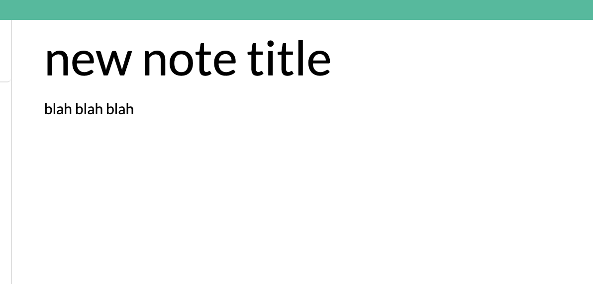

# Note-Taker

## Description

The goal with this application was to get used to express routes and creating post, delete and get routes. It was challenging connecting code to something that was already partially written, but through looking at different sources and examples, and some help from my tutors, I got the application running. 

## Installation
In order to install the code for this application, you'll need node.js and some sort of text editor. Run npm i in the commandline and then nodemon if you have it, for easy editing with a server. Then run npm start in the commandline to start up the server and open up your browser onto localhost:3002/ 
## Usage
To use this application, click the get started button to go to the notes part of the application. 

Once you click on the get started button you will be brought to the main note taking page. 

click on where it says note title and then the note text, then start typing whatever you want into the note. 

Once you have finished typing your new note, click the floppy disk on the top right corner to save your new note. 

Once you've clicked the floppy disk icon then your new note will appear on the left hand side of the page, for later reading. 

[Link to deployed application](https://chelbys-note-taker.herokuapp.com/)

## Credits
My tutor Eric, and some repositories from other bootcamps for the same assignment, I probably looked at at least 20. 

## License
MIT License

Copyright (c) [2022] [chel

Permission is hereby granted, free of charge, to any person obtaining a copy
of this software and associated documentation files (the "Software"), to deal
in the Software without restriction, including without limitation the rights
to use, copy, modify, merge, publish, distribute, sublicense, and/or sell
copies of the Software, and to permit persons to whom the Software is
furnished to do so, subject to the following conditions:

The above copyright notice and this permission notice shall be included in all
copies or substantial portions of the Software.

THE SOFTWARE IS PROVIDED "AS IS", WITHOUT WARRANTY OF ANY KIND, EXPRESS OR
IMPLIED, INCLUDING BUT NOT LIMITED TO THE WARRANTIES OF MERCHANTABILITY,
FITNESS FOR A PARTICULAR PURPOSE AND NONINFRINGEMENT. IN NO EVENT SHALL THE
AUTHORS OR COPYRIGHT HOLDERS BE LIABLE FOR ANY CLAIM, DAMAGES OR OTHER
LIABILITY, WHETHER IN AN ACTION OF CONTRACT, TORT OR OTHERWISE, ARISING FROM,
OUT OF OR IN CONNECTION WITH THE SOFTWARE OR THE USE OR OTHER DEALINGS IN THE
SOFTWARE.